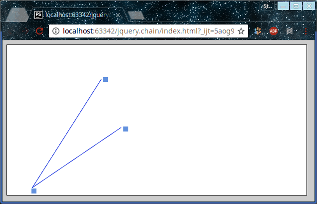

# jquery.chain
Follow for dots use a lines.

[Example](https://jsfiddle.net/StepanMas/ps2pj7p9/1/)




### Initilization:
```javascript
var chain = new $.Chain({
    line  : {
        color: '#b59371', // color of line
        width: 1 // width of line
    },
    dots  : {
        size : [2, 2], // size rect, first arg. like radius for round
        color: '#b59371' // color rect or round
    },
    el    : '.Chain', // selector or node
    follow: '.Chain-dot', // items by block, selector or array nodes
    add   : 'round' // enable round, rect or false
});

chain.render();
```

### Methods

```javascript
chain.stop() // stop follow
chain.start()
chain.clear(bool) // clear canvas, if set param force=true to clear cache too and to rm canvas
```

### To use the offset
```html
<div class="dot-1 Chain-dot" data-left="5" data-top="5"></div> // data attributes for offset
```

### Install

    npm install jquery.chain
    bower install jquery.chain


###### MIT License